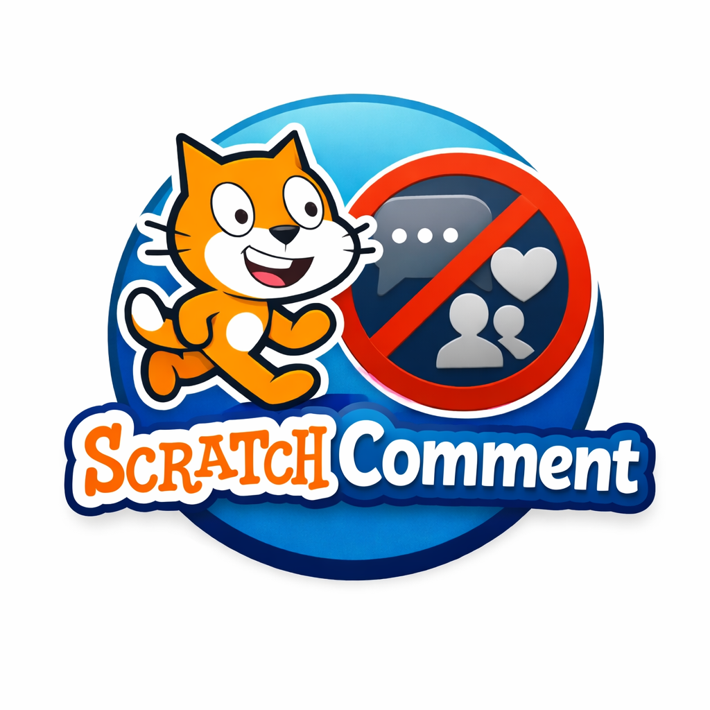

# Scratch Comment Blocker

A browser extension for parental controls that removes comment functionality from the Scratch website (scratch.mit.edu).

## What It Does

This extension hides and removes all comment-related features from Scratch, including:

- **Reading comments**: All comment sections are hidden on projects, profiles, and studios
- **Writing comments**: Comment input forms and composition areas are removed
- **Comment notifications**: Comment-related UI elements are blocked

## Installation Instructions

### For Chrome/Edge/Brave

1. Download or clone this extension folder to your computer
2. Open your browser and go to the extensions page:
   - Chrome: `chrome://extensions/`
   - Edge: `edge://extensions/`
   - Brave: `brave://extensions/`
3. Enable "Developer mode" (toggle in the top-right corner)
4. Click "Load unpacked"
5. Select the folder containing this extension
6. The extension is now active!

### For Firefox

1. Download or clone this extension folder to your computer
2. Open Firefox and go to `about:debugging#/runtime/this-firefox`
3. Click "Load Temporary Add-on"
4. Navigate to the extension folder and select the `manifest.json` file
5. The extension is now active!

**Note**: In Firefox, temporary extensions are removed when you close the browser. For permanent installation, you'll need to package and sign the extension through Mozilla Add-ons.

## How It Works

The extension uses two methods to block comments:

1. **CSS**: Hides comment elements immediately using `display: none`
2. **JavaScript**: Actively removes comment elements from the page and watches for dynamically loaded content

This dual approach ensures comments are blocked even as Scratch's React-based interface updates.

## Uninstallation

### Chrome/Edge/Brave
1. Go to extensions page (`chrome://extensions/` or `edge://extensions/`)
2. Find "Scratch Comment Blocker"
3. Click "Remove"

### Firefox
1. Go to `about:addons`
2. Find "Scratch Comment Blocker"
3. Click "Remove"

## Privacy

This extension:
- Only runs on scratch.mit.edu
- Does not collect any data
- Does not communicate with external servers
- Does not track browsing history
- Works entirely locally in your browser

## Troubleshooting

**Comments still visible?**
- Try refreshing the Scratch page (Ctrl+R or Cmd+R)
- Make sure the extension is enabled in your browser's extension settings
- Check browser console for any errors

**Extension not loading?**
- Verify all files are in the same folder
- Check that manifest.json is valid JSON
- Ensure Developer mode is enabled

## Technical Details

- **Manifest Version**: 3 (compatible with latest Chrome/Edge)
- **Permissions**: Only runs on scratch.mit.edu
- **Target Elements**: All comment-related CSS classes and components identified in Scratch's codebase

## Support

This is a simple parental control tool. If you encounter issues:
1. Check that you're using a recent version of Chrome, Edge, or Firefox
2. Verify the extension is enabled and has permission to run on scratch.mit.edu
3. Try disabling and re-enabling the extension

## License

This extension is provided as-is for parental control purposes.
